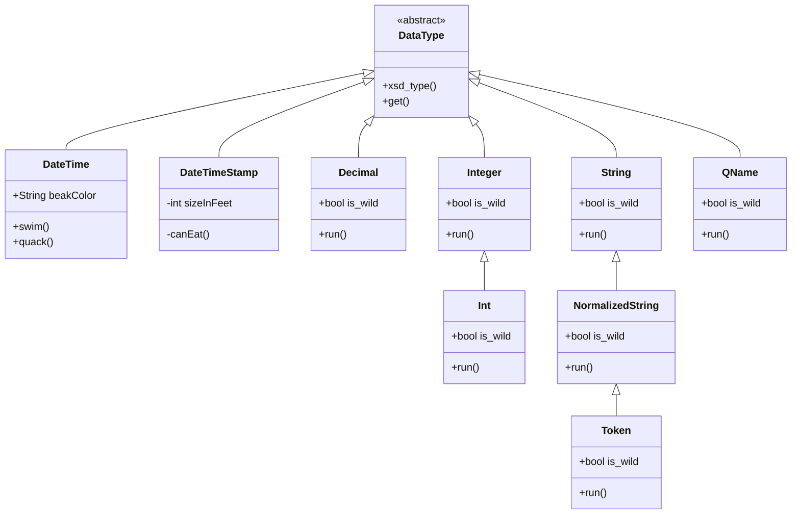

# Base Data Types Class Hierarchy

## Data Types Class Diagram

```mermaid
classDiagram
    DataType <|-- DateTime
    DataType <|-- DateTimeStamp
    DataType <|-- Decimal
    DataType <|-- Integer
    Integer <|-- Int
    DataType <|-- String
    String <|-- NormalizedString
    NormalizedString <|-- Token
    DataType <|-- QName
    
    class DataType {
        <<abstract>>
        +xsd_type()
        +get()
    }
      
    class DateTime {
        +String beakColor
        +swim()
        +quack()
    }
    
    class DateTimeStamp {
        -int sizeInFeet
        -canEat()
    }
    
    class Decimal {
        +bool is_wild
        +run()
    }

    class Int {
        +bool is_wild
        +run()
    }

    class Integer {
        +bool is_wild
        +run()
    }

    class NormalizedString {
        +bool is_wild
        +run()
    }

    class QName {
        +bool is_wild
        +run()
    }


    class String {
        +bool is_wild
        +run()
    }

    class Token {
        +bool is_wild
        +run()
    }
```